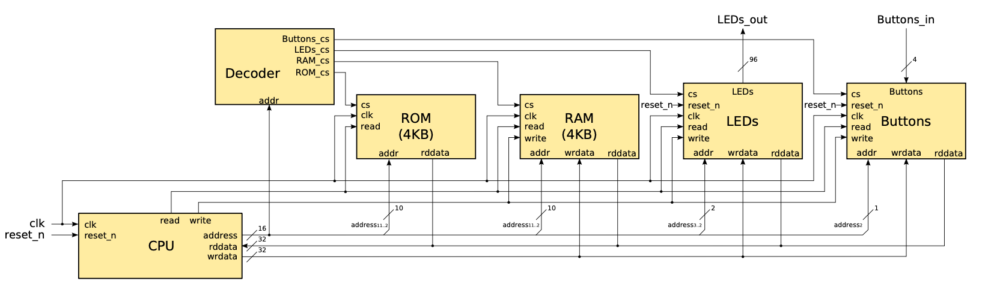
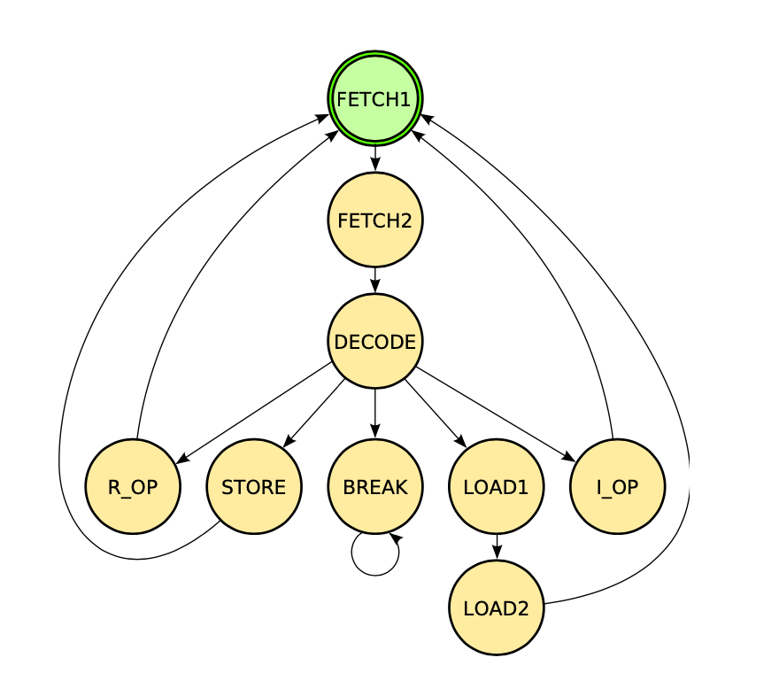

# Multicycle_Nios_Processor

In this lab we implemented a multicycle Nios II processor. We implemented it 
step-by-step— beginning with a CPU that executes a few basic instructions 
and extending it progressively to cover all the requested functionalities of the Nios II.

 
Here's how the multicycle processor is connected to the rest of the system : 

The processor can also be in many states, ordered in the following way :

Use an FPGA to simulate the processor !